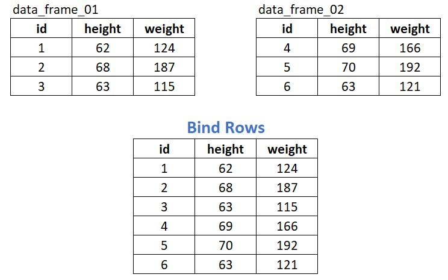
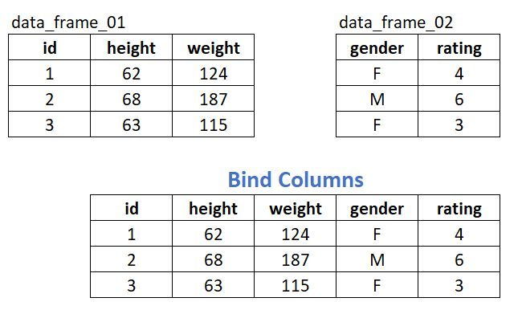
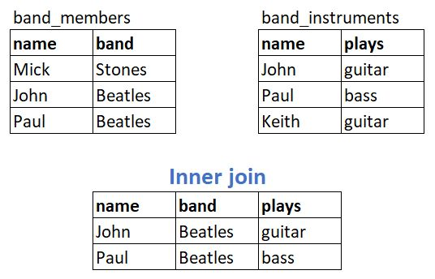
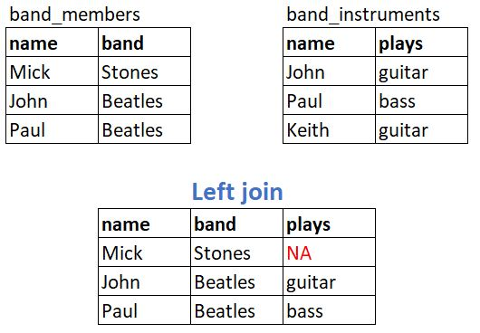
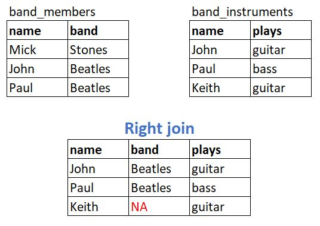
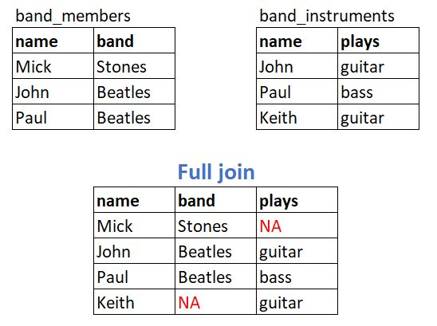
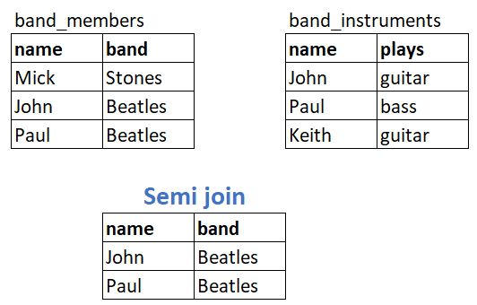
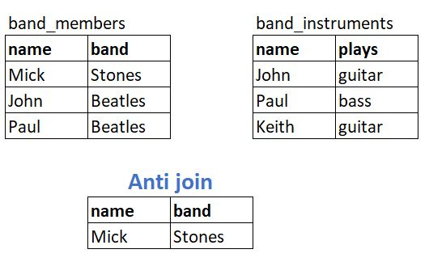
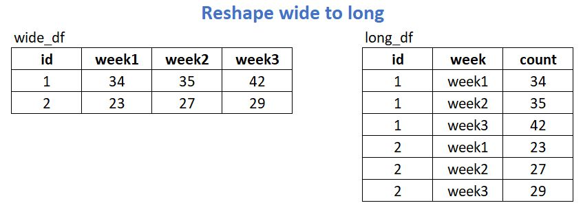

```{r setup, include=FALSE}
knitr::opts_chunk$set(echo = FALSE)
```

## Agenda

Cover the following topics with examples and exercises using the `dplyr` and `tidyr` packages:

- Binding data frames
- Merging or Joining data frames
- Reshaping data frames

Each are common tasks for wrangling data into a form suitable for analysis and visualization.

## Binding data frames

- Row binding: stacking data frames on top of one another
- Column binding: setting data frames next to each other
- Row binding is more common; often used when reading in multiple files of matching structure that need to be combined into one data frame
- Example: importing 10 Excel worksheets for years 2000 - 2009, and then combining into one data frame
- `dplyr` functions: `bind_rows` and `bind_cols`


## Row binding

`bind_rows(data_frame_01, data_frame_02)`



## Column binding

`bind_cols(data_frame_01, data_frame_02)`



## Binding tips 

- When binding rows, columns are matched by name, and any missing columns will be filled with NA.
- When binding rows, the optional `.id` argument can be used to link each row to its original data frame.
- When binding columns, rows are matched by position. All data frames must have the same number of rows.
- Vectors and matrices can also be binded by rows or columns


## Merging or Joining data frames

* Two types of merges, or joins:
    + **Mutating join**: Join data frames based on a common column (or columns), called "keys"
    + **Filtering join**: keep rows in one data frame based on having (or not having) membership in another data frame
* Frequently used to combine two different sources of data. 
* Example: merge subject demographic data with subject lab data
* `dplyr` functions: `inner_join`, `left_join`, `right_join`, `full_join`, `semi_join`, `anti_join`
 

## Inner Join

Retain only those rows with matching keys in both data sets.
`inner_join(band_members,band_instruments,by="name")`




## Left Join

Retain everything in the left data set, merge matches from right.
`left_join(band_members,band_instruments,by="name")`



## Right Join

Retain everything in the right data set, merge from left.
`right_join(band_members,band_instruments,by="name")`




## Full Join

Retain all rows in both data sets.
`full_join(band_members,band_instruments,by="name")`



## Semi Join

Retain all rows from left that have matching values in right.
`semi_join(band_members,band_instruments,by="name")`



## Anti Join

Retain all rows from left that do NOT have matching values in right.
`anti_join(band_members,band_instruments,by="name")`




## Reshaping data frames

- Taking column names and making them values in a single column, and vice versa; similiar to transposing data in Excel
- Often expressed as reshaping "wide to long", or "long to wide"
- Reshaping wide to long is very common in R; often needed to accommodate modeling and plotting functions
- `tidyr` functions: `gather` (wide to long) and `spread` (long to wide)

## Reshaping wide to long

"gather" columns week1 - week3 into two columns, one for the column headers (_key_) and the other for the values in the columns (_value_).

`gather(wide_df,key="week",value="count",week1:week3)`



## Time to practice!

Let's go the workshop R script for demonstrations and exercises.


## References

**R for Data Science**: http://r4ds.had.co.nz/

Free online edition of the O'Reilly book _R for Data Science_, by Garrett Grolemund and Hadley Wickham. See chapters 12 and 13.

The UVa Library also has a physical copy.


## Thanks for coming

* For statistical consulting: statlab@virginia.edu

* Sign up for more workshops or see past workshops:
http://data.library.virginia.edu/training/

* Register for the Research Data Services newsletter to be notified of new workshops: http://data.library.virginia.edu/newsletters/
